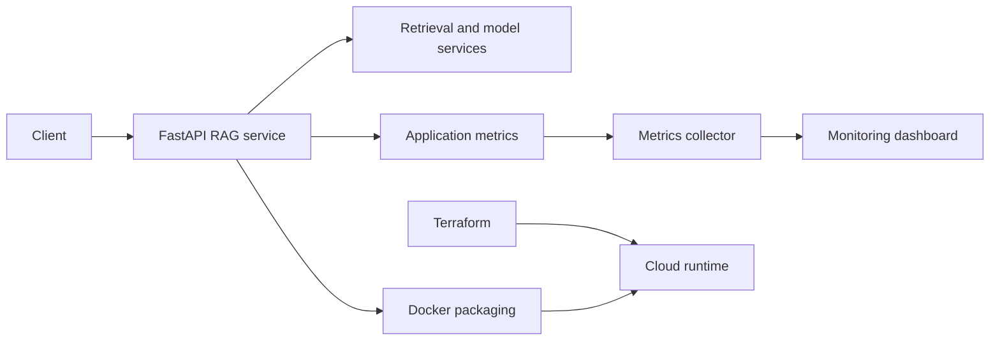

# RAG API, Docker and Monitoring

**Python service and infrastructure learning project scaffold** by [Bobby Rovy](https://github.com/brovy23-GD) | [LinkedIn](https://www.linkedin.com/in/bobbyrovy)

## Project goal

Explore how a retrieval-augmented generation API could be packaged in Docker, configured for Azure with Terraform, tested in CI, and observed with monitoring dashboards. The repository currently represents **early-stage infrastructure and application scaffolding**, not a deployed end-to-end platform.

## What is actually in this repository?

| Path | Current state |
| --- | --- |
| `app/main.py` | Empty; no FastAPI endpoints or RAG logic committed |
| `app/requirements.txt` | Lists FastAPI, Uvicorn, OpenAI SDK and python-dotenv dependencies |
| `docker/Dockerfile` | Initial Python 3.11 container definition; build path and functionality are not validated |
| `terraform/main.tf` | Terraform/Azure provider configuration; no Azure resources defined |
| `.github/workflows/ci.yml` | Placeholder workflow that prints a setup message; it does not build, test or deploy the application |
| `monitoring/grafana-dashboard.json` | Empty; no dashboard or metrics integration committed |
| `docs/runbook.md` | Empty; no verified run or deployment instructions |

**Current status:** No working application, container image, live monitoring, or cloud deployment is demonstrated by the checked-in files. The previous README backup describes intended capabilities, not verified completed features.

## Intended architecture (not yet implemented)

## Next development milestones

1. Implement the FastAPI application and retrieval-augmented generation flow.
2. Correct and validate the Docker build context, application startup, and dependency installation.
3. Write meaningful unit and integration tests and replace the CI placeholder with real checks.
4. Define the Azure resources in Terraform and document secret management.
5. Instrument the service, configure metrics collection, and add a working Grafana dashboard.
6. Document and capture a reproducible local demo before claiming a deployed system.

For a more developed C#/.NET portfolio project, see [Skill Builder Pro](https://github.com/brovy23-GD/Skill-Builder-Pro-).

**Contact:** [LinkedIn](https://www.linkedin.com/in/bobbyrovy)
